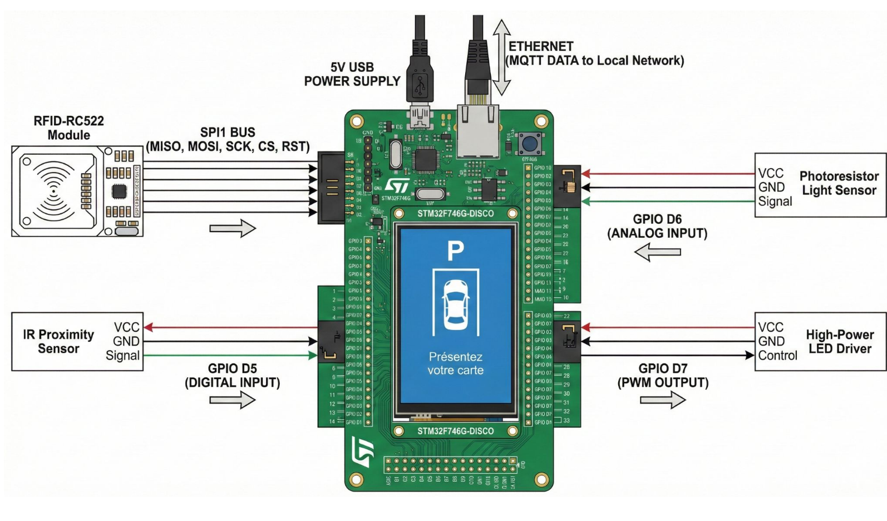

# 🏆 PSM - Modular Smart Parking System
### *Winner of "Most Technical Project" - Digital Majors Competition 2025*

  
  
<em>Our award-winning prototype at the competition</em>

---
## 🏅 **Award & Recognition**
We are proud to announce that **PSM won the "Most Technical Project" award** at Digital Majors Competition 2025 !
Our solution stood out for its:
* ✅ **Distributed IoT architecture** combining FPGA, STM32, and BeagleY-AI
* ✅ **Custom RISC-V SoC** implemented on FPGA
* ✅ **Real-time ANPR system** with OpenCV + Tesseract
* ✅ **Industrial-grade implementation** with Zephyr RTOS

  
  
<em>3D model of our mechanical design</em>

---

## 🌍 **Choose Your Language**
For full project details, please select your preferred language:

🇫🇷 **[Version Française (README_fr.md)](README_FR.md)**
🇬🇧 **[English Version (README_en.md)](README_EN.md)**

---

## 🔧 **Quick Overview**
**Key Features:**
- **AI-powered ANPR** (Automatic Number Plate Recognition)
- **Distributed MQTT network** with BeagleY-AI as central broker
- **Custom RISC-V SoC** on FPGA for motor control
- **Zephyr RTOS** for real-time RFID processing
- **Modular design** with 3D-printed mechanical components

**Tech Stack:**

---

## 👥 **Project Team**
* **FALDA Andy**
* **CAUQUIL Vincent**
* **ES-SRIEJ Youness**
* **CLERVILLE Annabelle**

---

## 📸 **Gallery**

  <table>
    <tr>
      <td></td>
      <td></td>
    </tr>
    <tr>
      <td align="center"><em>Complete system</em></td>
      <td align="center"><em>RFID entry module</em></td>
    </tr>
  </table>

> *Note: For more images and technical diagrams, please refer to the full documentation in [README_fr.md](README_FR.md) or [README_en.md](README_EN.md).*
